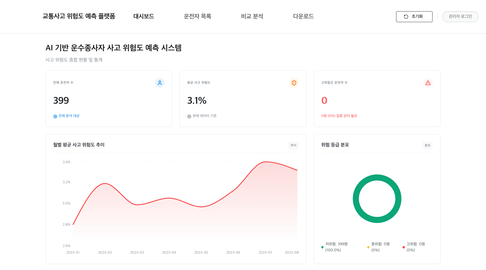

# 교통사고 위험도 예측 플랫폼

 [](LICENSE)

운수종사자의 검사 결과와 과거 사고 이력을 학습한 앙상블 모델로 교통사고 위험도를 예측하고, SHAP 해석과 함께 화면에서 조회·관리하는 웹 플랫폼입니다. 예측 모델과 FastAPI 서빙, 관리 웹, 망분리 환경용 오프라인 배포 체계까지 전 구간을 담았습니다.

인터넷이 없는 현장 PC에서 설치와 운영이 끝까지 되어야 한다는 제약에서 출발한 프로젝트입니다. 그래서 Python·JRE·Nginx 런타임과 오프라인 wheel을 전부 배포 zip에 담는 포터블 구조를 잡았고, 예측·학습을 담당하는 FastAPI AI 엔진과 React 프론트엔드, 공공 표준 프레임워크(eGovFrame) 백엔드를 Nginx 뒤에 3-티어로 묶었습니다.



샘플 데이터를 올려 로컬에서 학습과 예측을 실행한 대시보드 화면입니다.

## 구현 범위

- 위험도 예측: 업로드된 검사 결과를 도메인별 스태킹 앙상블과 시퀀스 LightGBM으로 각각 예측하고, 두 계열의 예측을 가중 블렌딩해 위험 점수(0~1)로 산출합니다. 시퀀스 모델 추론이 실패하면 스태킹 단독으로 폴백합니다.
- 해석: SHAP 값으로 개인별·전역 피처 기여도를 설명하고, 결과를 PDF·ZIP 리포트로 내려받을 수 있습니다.
- 화면 구성: 대시보드, 운전자 목록, 개인 진단, 비교 분석, 다운로드, 관리자 화면(데이터 업로드, 모델 재학습, 성능 지표 조회)으로 이루어집니다.
- 데이터 관리: 신규검사(A)·자격유지검사(B)·사고 이력(sago) 세 도메인의 Excel을 업로드하면 학습 스키마로 변환해 DB에 적재하고, 동일인의 과거 검사·예측 결과를 추적합니다.
- 운영 기능: 모델 버전 관리(활성 버전 전환·삭제·용량 조회), 중단된 학습의 자동 복구, 날짜별 로그 로테이션, 시스템 사양에 맞춘 병렬도 자동 조정을 포함합니다.
- 배포 체계: 오프라인 설치 스크립트(방화벽 등록, 자동시작 태스크, 기동 헬스체크)와 배포 zip 빌드 파이프라인(개발 잔여물 검사 포함)을 갖췄습니다.

## 아키텍처

```text
브라우저 ─ http://localhost:3000
   └─ Nginx (:3000)
        ├─ /                              → React SPA 정적 파일
        ├─ /api/admin·analysis·predict/*  → FastAPI AI 엔진 (:8000)
        └─ /api/* (나머지)                 → Spring Boot eGovFrame (:8080)
```

프록시는 구체적인 경로가 먼저 매칭되도록 구성했고, Nginx(`deploy/nginx/nginx.conf`)와 개발용 Vite(`frontend/vite.config.js`)가 같은 규칙을 따릅니다.

## 기술 스택

| 영역 | 기술 |
|---|---|
| AI 엔진 |        |
| 프론트엔드 |    |
| 백엔드 |    |
| 인프라·배포 |   |

## 실행 방법

개발 환경(Mac/Linux)은 Python 3.10과 [uv](https://github.com/astral-sh/uv), Node.js 20+, Java 8 JDK와 Maven이 필요합니다.

```bash
# 의존성 설치
make install-ai          # ai-engine: uv sync
make install-frontend    # frontend: npm install

# 서비스 실행 (3개 병렬 기동)
make dev-ai        # AI 엔진   — http://localhost:8000
make dev-frontend  # 프론트엔드 — http://localhost:3000
make dev-backend   # 백엔드    — http://localhost:8080
```

브라우저에서 http://localhost:3000 에 접속합니다. 관리자 계정은 로컬 개발 기본값이 `admin` / `1`이고, 배포 시에는 설치 과정에서 생성되는 `admin.conf`로 지정합니다(`ai-engine/.env.example` 참고).

운영 배포는 `deploy/build-package.sh`로 배포 zip(약 400MB)을 만들어 운영 PC에서 `install.bat`을 실행하는 방식이며, [deploy/README.md](deploy/README.md)에 정리했습니다.

## 모델과 저장된 학습 결과

- 스태킹 계열: 신규검사(A)·자격유지검사(B) 도메인별로 HistGradientBoosting·XGBoost·CatBoost 7개 구성을 학습하고, Dirichlet 탐색으로 가중치와 온도를 최적화해 결합합니다. 피처는 시점 누수가 생기지 않도록 각 검사 시점 이전의 기록만으로 만든 개인·코호트 prior를 씁니다.
- 시퀀스 계열: 검사 문항의 시퀀스 응답과 과거 검사 대비 변화량 피처로 도메인 통합 LightGBM을 5-fold로 학습합니다.
- 두 계열의 예측을 고정 가중치로 블렌딩해 최종 위험 점수를 만듭니다(`ai-engine/src/config/ensemble_config.py`).

아래는 실제 데이터로 학습했을 때 저장된 결과입니다. 검사 데이터가 저장소에 포함되지 않아 이 수치는 저장소만으로 재현할 수 없습니다.

| 모델 | AUC |
|---|---|
| 스태킹 (신규검사 A) | 0.7277 |
| 스태킹 (자격유지검사 B) | 0.7268 |
| 시퀀스 (통합) | 0.7421 |

전체 학습은 약 44분이 걸렸고, 관리자 화면에서는 AUC 외에 복합 스코어(0.5·(1−AUC) + 0.25·Brier + 0.25·ECE)와 Brier·ECE·MCC를 함께 보여줍니다.

## 프로젝트 구조

```text
.
├── ai-engine/                # FastAPI + ML (port 8000)
│   └── src/
│       ├── api/              # 업로드·예측·관리자 엔드포인트
│       ├── core/             # DB, 상수, 분석 캐시
│       ├── data/             # Excel 변환, 라벨링, 피처 구성
│       ├── training/         # stack_trainer, seq_trainer
│       ├── inference/        # stack_engine, seq_engine, 모델 로더
│       ├── models/           # 앙상블·보정·지표
│       └── services/         # 예측·학습·SHAP 서비스
├── backend/                  # Spring Boot + eGovFrame (port 8080)
├── frontend/                 # React + Vite + Mantine (port 3000)
│   └── src/
│       ├── pages/risk/       # 대시보드·목록·진단·분석·다운로드
│       └── pages/admin/      # 관리자 대시보드
├── deploy/                   # 배포 zip 빌드와 Windows 설치 스크립트
│   ├── build-package.sh      # 번들 zip 빌드 (잔여물 검사 포함)
│   ├── scripts/              # install.bat / start.bat / stop.bat
│   └── nginx/nginx.conf
├── Makefile                  # 개발 서버 실행 명령
└── VERSION
```

## 구현하면서 신경 쓴 점

- 망분리 환경에서는 실패한 설치를 원격으로 도와줄 방법이 없어서, 설치 스크립트가 기존 프로세스 정리부터 방화벽 등록, 자동시작 태스크, 기동 후 헬스체크까지 한 번에 처리하도록 만들었습니다. 배포 zip을 만드는 빌드 스크립트는 마지막 단계에서 DB 파일이나 캐시 같은 개발 잔여물이 zip에 섞이지 않았는지 검사하고, 발견되면 빌드를 중단합니다.
- 검사 데이터 Excel은 전부 문자열로 읽습니다(`dtype=str`). 수치로 읽으면 식별자의 앞자리 0이 사라지기 때문입니다. 사람 단위 식별자 정규화도 한 함수(`resolve_pk`)에만 두어 화면·이력·예측이 같은 기준을 쓰도록 했습니다.
- 재학습 중 PC가 꺼지거나 프로세스가 죽어도 다음 기동 때 서버가 미완성 모델 버전을 정리하고 학습 상태를 복구합니다. 학습된 모델은 파일이 아니라 DB에 버전 단위로 저장해서, 관리자 화면에서 활성 버전을 전환하거나 이전 버전으로 되돌릴 수 있습니다.
- 저사양 PC부터 서버급까지 설치 대상이 다양해서, 기동 시 CPU·메모리를 읽어 학습·설명 작업의 병렬도와 DB 캐시 크기를 자동으로 맞춥니다.

## 한계

- 검사 데이터와 학습된 모델은 개인정보가 포함되어 저장소에 넣지 않았습니다. 위 성능 수치는 저장된 학습 결과 기준입니다.
- Spring 백엔드는 공공 표준 프레임워크 요건에 맞춘 최소 구성이고, 예측·학습 API는 대부분 FastAPI AI 엔진이 담당합니다.
- 자동화 테스트는 없습니다. 배포 전 검증은 빌드 스크립트의 잔여물 검사와 수동 절차에 의존합니다.

## 라이선스

Apache License 2.0. 자세한 내용은 [LICENSE](LICENSE)에 있습니다.
